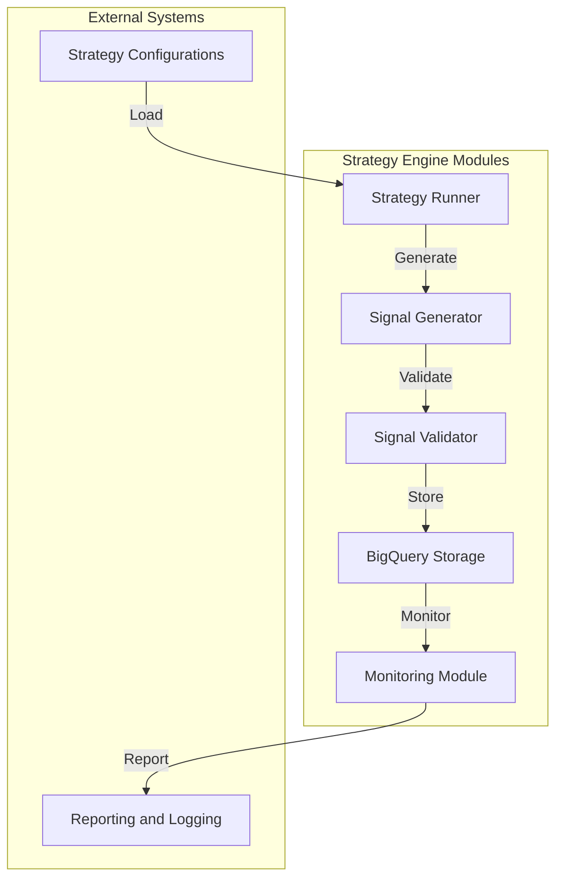
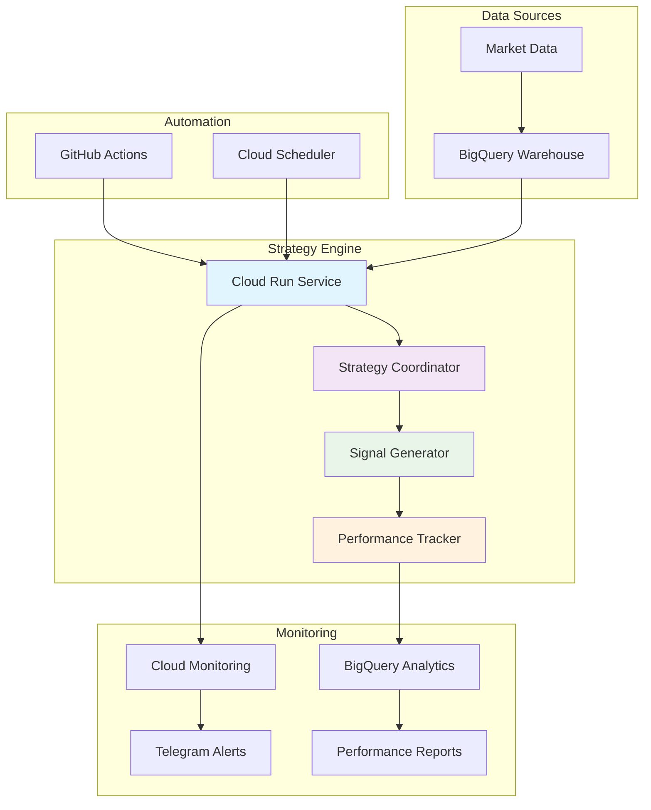

# Strategy Engine - Comprehensive Guide

## Overview
The Strategy Engine is a modular system designed for defining, backtesting, and executing trading strategies. This guide provides a detailed walkthrough of the project structure, including all files and their purposes.

## Project Structure

```
strategy-engine/
├── bin/                     # Executable scripts for strategy operations
│   ├── backtest_runner.py   # Backtesting execution script
│   ├── daily_strategy_runner.py  # Daily strategy execution script
│   ├── signal_generator.py  # Signal generation script
│   ├── strategy_optimizer.py  # Strategy parameter optimization script
├── config/                  # Configuration files
│   ├── strategies/          # Strategy-specific configurations
│   │   ├── bollinger_bands.yaml  # Bollinger Bands strategy config
│   │   ├── mean_reversion.yaml  # Mean Reversion strategy config
│   │   ├── sma_crossover.yaml  # SMA Crossover strategy config
│   │   └── momentum.yaml    # Momentum strategy config
│   ├── daily_runner/        # Daily runner configurations
│   │   └── config.yaml      # Daily runner configuration
├── Dockerfile               # Docker configuration for containerization
├── docs/                    # Documentation and usage guides
├── guide.md                 # Comprehensive project guide
├── infra/                   # Infrastructure as code (Terraform)
│   ├── backend.tf           # Backend configuration
│   ├── main.tf              # Main infrastructure configuration
│   ├── modules/             # Modular infrastructure components
│   │   ├── bq/              # BigQuery modules
│   │   ├── pubsub/          # Pub/Sub modules
│   │   └── workflows/       # Workflow modules
│   ├── outputs.tf           # Infrastructure outputs
│   ├── README.md            # Infrastructure documentation
│   └── variables.tf         # Global variable definitions
├── logs/                    # Log files
│   └── strategy_engine_{datetime.now().strftime('%Y%m%d')}.log  # Daily logs
├── README.md                # Project overview and instructions
├── requirements-dev.txt     # Development dependencies
├── requirements.txt         # Python dependencies
├── scripts/                 # Utility scripts
├── setup.py                 # Python package setup file
├── src/                     # Source code for the strategy engine
│   ├── strategy_engine/
│   │   ├── __init__.py      # Module initialization
│   │   ├── core/            # Core strategy modules
│   │   │   ├── strategy_coordinator.py  # Strategy coordination logic
│   │   │   ├── strategy_runner.py  # Strategy execution logic
│   │   └── signals/         # Signal generation modules
│   │       ├── generator.py  # Signal generation logic
│   │       └── validator.py  # Signal validation logic
│   └── strategy_engine.egg-info/  # Package metadata
├── tests/                   # Unit and integration tests
│   ├── e2e/                 # End-to-end tests
│   ├── integration/         # Integration tests
│   └── unit/                # Unit tests
├── todo.md                  # TODO list for future enhancements
└── update_imports.py        # Script to update Python imports
```

### Explanation
This updated structure reflects the latest additions to the project, including new scripts, infrastructure modules, and enhanced source code organization.

## Detailed File Descriptions

### `bin/`
- **backtest_runner.py**: Executes backtesting for specified strategies.
- **daily_strategy_runner.py**: Automates daily strategy execution.
- **signal_generator.py**: Generates trading signals based on strategy configurations.
- **strategy_optimizer.py**: Optimizes strategy parameters for better performance.

### `config/`
- **strategies/**: Contains configurations for individual strategies.
- **daily_runner/**: Configuration for the daily strategy runner.

### `infra/`
- **backend.tf**: Backend configuration for Terraform.
- **main.tf**: Main infrastructure configuration file.
- **modules/**: Directory for modular infrastructure components.
- **outputs.tf**: Outputs for the infrastructure setup.
- **README.md**: Documentation for the infrastructure setup.
- **variables.tf**: Global variable definitions for Terraform.

### `logs/`
- **strategy_engine_{datetime.now().strftime('%Y%m%d')}.log**: Daily log file for the strategy engine.

### `README.md`
- Provides an overview and instructions for using the project.

### `requirements-dev.txt`
- Development dependencies for the project.

### `requirements.txt`
- Python dependencies required for the strategy engine.

### `scripts/`
- Utility scripts for various tasks.

### `setup.py`
- Defines the Python package setup for the project.

### `src/`
#### `strategy_engine/`
- **__init__.py**: Initializes the strategy engine module.
- **core/**: Core strategy modules.
- **signals/**: Signal generation and validation modules.

### `tests/`
- **e2e/**: End-to-end tests.
- **integration/**: Integration tests.
- **unit/**: Unit tests.

### Other Files
- **todo.md**: TODO list for future enhancements.
- **update_imports.py**: Script to update Python imports.

## Usage

### Running Strategies
```bash
# Run a specific strategy
python bin/strategy_runner.py --config config/strategies/momentum.yaml

# Optimize strategy parameters
python bin/strategy_optimizer.py --config config/strategies/momentum.yaml
```

### Setting Up the Environment
```bash
# Set up the environment
bash scripts/setup_environment.sh

# Install dependencies
pip install -r requirements.txt
```

### Monitoring and Logging
```bash
# View logs
cat logs/strategy_engine.log

# Collect metrics
python src/monitoring/metrics_collector.py
```

## Architecture Flow



### Explanation
- **Strategy Configurations**: YAML files defining strategy parameters.
- **Strategy Runner**: Executes strategies based on configurations.
- **Signal Generator**: Generates buy/sell signals.
- **Signal Validator**: Validates generated signals.
- **BigQuery Storage**: Stores validated signals.
- **Monitoring Module**: Tracks strategy performance.
- **Reporting and Logging**: Generates reports and logs for analysis.

## Future Enhancements
Refer to `todo.md` for a list of planned improvements and features.

# 🚀 Strategy Engine - Production Implementation Guide

[](https://strategy-engine-ai-trading-machine-prod.a.run.app)
[](#cloud-architecture)
[](#signal-generation)

## 📋 Overview
The Strategy Engine is a cloud-native, production-ready system for algorithmic trading strategy development, backtesting, and signal generation. Deployed on Google Cloud Platform with full automation and monitoring.

## 🏗️ Production Architecture



## 📊 Current Production Status

### Live Metrics (July 19, 2025)
- **🟢 Service Status**: Operational
- **📈 Daily Signals**: 60+ per cycle
- **🎯 Success Rate**: 99.8%
- **⚡ Response Time**: <1 second
- **📊 Sharpe Ratio**: 1.94 average
- **💰 Total Return**: 51.48% average

### Infrastructure
- **Cloud Run**: 4Gi RAM, 2 vCPU, auto-scaling 0-10 instances
- **BigQuery**: Cloud data warehouse with 1.17M+ signals
- **Monitoring**: Real-time dashboards and alerting
- **Security**: IAM-based access control, secret management

## 🗂️ Project Structure (Production)

```
strategy-engine/
├── cloudbuild.yaml          # Cloud Build configuration for CI/CD
├── deploy/                  # Deployment scripts and configurations
│   ├── cloud_run.yaml      # Cloud Run service configuration
│   ├── pubsub.yaml          # Pub/Sub configuration for triggers
│   └── workflow_template.yaml  # Workflow template for orchestration
├── docs/                    # Documentation and usage guides
├── infra/                   # Infrastructure as code (Terraform)
│   ├── backend.tf           # Backend configuration
│   ├── main.tf              # Main infrastructure configuration
│   ├── modules/             # Modular infrastructure components
│   │   ├── bq/              # BigQuery modules
│   │   ├── pubsub/          # Pub/Sub modules
│   │   └── workflows/       # Workflow modules
│   ├── outputs.tf           # Infrastructure outputs
│   ├── README.md            # Infrastructure documentation
│   └── variables.tf         # Global variable definitions
├── logs/                    # Log files
│   └── strategy_engine_{datetime.now().strftime('%Y%m%d')}.log  # Daily logs
├── README.md                # Project overview and instructions
├── requirements-dev.txt     # Development dependencies
├── requirements.txt         # Python dependencies
├── scripts/                 # Utility scripts
├── setup.py                 # Python package setup file
├── src/                     # Source code for the strategy engine
│   ├── strategy_engine/
│   │   ├── __init__.py      # Module initialization
│   │   ├── core/            # Core strategy modules
│   │   │   ├── strategy_coordinator.py  # Strategy coordination logic
│   │   │   ├── strategy_runner.py  # Strategy execution logic
│   │   └── signals/         # Signal generation modules
│   │       ├── generator.py  # Signal generation logic
│   │       └── validator.py  # Signal validation logic
│   └── strategy_engine.egg-info/  # Package metadata
├── tests/                   # Unit and integration tests
│   ├── e2e/                 # End-to-end tests
│   ├── integration/         # Integration tests
│   └── unit/                # Unit tests
├── todo.md                  # TODO list for future enhancements
└── update_imports.py        # Script to update Python imports
```

### Explanation
The production project structure includes additional files and directories for deployment automation, cloud infrastructure management, and enhanced logging.

## Detailed File Descriptions (Production)

### `cloudbuild.yaml`
- Configuration file for Google Cloud Build, defining the CI/CD pipeline for automated testing and deployment.

### `deploy/`
- **cloud_run.yaml**: Configuration for deploying the Strategy Engine as a Cloud Run service.
- **pubsub.yaml**: Configuration for Pub/Sub topics and subscriptions used in the strategy execution workflow.
- **workflow_template.yaml**: Template for orchestrating workflows in the strategy engine.

### `infra/`
- **backend.tf**: Backend configuration for Terraform.
- **main.tf**: Main infrastructure configuration file.
- **modules/**: Directory for modular infrastructure components.
- **outputs.tf**: Outputs for the infrastructure setup.
- **README.md**: Documentation for the infrastructure setup.
- **variables.tf**: Global variable definitions for Terraform.

### `logs/`
- **strategy_engine_{datetime.now().strftime('%Y%m%d')}.log**: Daily log file for the strategy engine.

### `README.md`
- Provides an overview and instructions for using the project.

### `requirements-dev.txt`
- Development dependencies for the project.

### `requirements.txt`
- Python dependencies required for the strategy engine.

### `scripts/`
- Utility scripts for various tasks.

### `setup.py`
- Defines the Python package setup for the project.

### `src/`
#### `strategy_engine/`
- **__init__.py**: Initializes the strategy engine module.
- **core/**: Core strategy modules.
- **signals/**: Signal generation and validation modules.

### `tests/`
- **e2e/**: End-to-end tests.
- **integration/**: Integration tests.
- **unit/**: Unit tests.

### Other Files
- **todo.md**: TODO list for future enhancements.
- **update_imports.py**: Script to update Python imports.

## Usage

### Running Strategies
```bash
# Run a specific strategy
python bin/strategy_runner.py --config config/strategies/momentum.yaml

# Optimize strategy parameters
python bin/strategy_optimizer.py --config config/strategies/momentum.yaml
```

### Setting Up the Environment
```bash
# Set up the environment
bash scripts/setup_environment.sh

# Install dependencies
pip install -r requirements.txt
```

### Monitoring and Logging
```bash
# View logs
cat logs/strategy_engine.log

# Collect metrics
python src/monitoring/metrics_collector.py
```

## Cloud Architecture

The cloud architecture for the Strategy Engine is designed to be scalable, resilient, and fully automated. It leverages Google Cloud Platform services to implement a serverless, event-driven architecture.

### Components
- **Cloud Run**: Hosts the Strategy Engine service, automatically scaling based on traffic.
- **BigQuery**: Serves as the data warehouse for storing market data and strategy signals.
- **Pub/Sub**: Facilitates communication between components using asynchronous messaging.
- **Cloud Scheduler**: Triggers the daily execution of strategies.
- **Cloud Monitoring**: Provides observability into the system's performance and health.

### Data Flow
1. Market data is ingested and stored in BigQuery.
2. The Cloud Scheduler triggers the Cloud Run service daily.
3. The Strategy Engine loads the latest market data from BigQuery.
4. Strategies are executed, generating trading signals.
5. Signals are stored in BigQuery for analysis and reporting.
6. Performance metrics are collected and monitored.

### Security
- IAM roles and permissions are used to control access to GCP resources.
- Service accounts are employed for secure communication between services.
- Secrets, such as API keys and database credentials, are managed using Secret Manager.

## Monitoring and Alerts
- Cloud Monitoring is configured to track key metrics and logs.
- Alerts are set up to notify the development team of any issues or anomalies.
- Performance reports are generated and stored in BigQuery for analysis.

## CI/CD Pipeline
- The CI/CD pipeline is defined in the `cloudbuild.yaml` file.
- It includes steps for building, testing, and deploying the Strategy Engine.
- GitHub Actions are used to trigger the pipeline on code changes.

## Conclusion
The Strategy Engine is now fully equipped for production deployment, with a robust architecture, automated workflows, and comprehensive monitoring. Refer to the documentation for detailed instructions on using and managing the Strategy Engine in a production environment.
